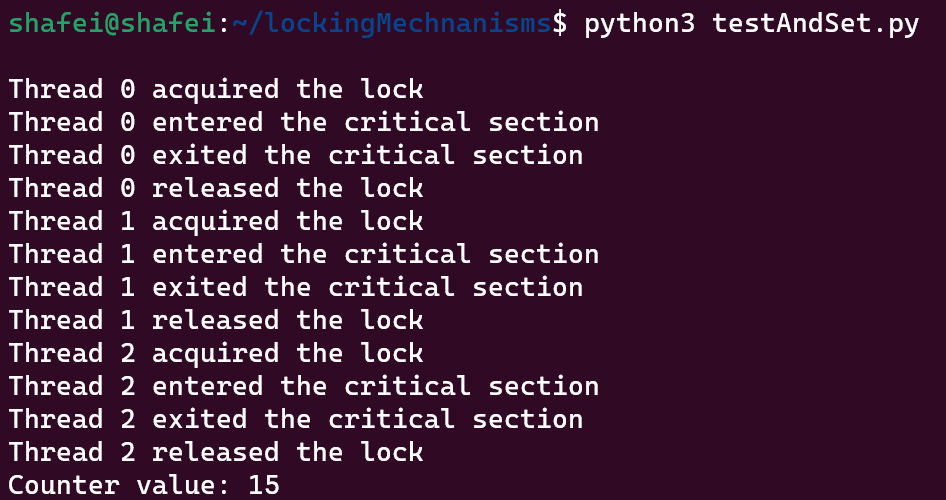
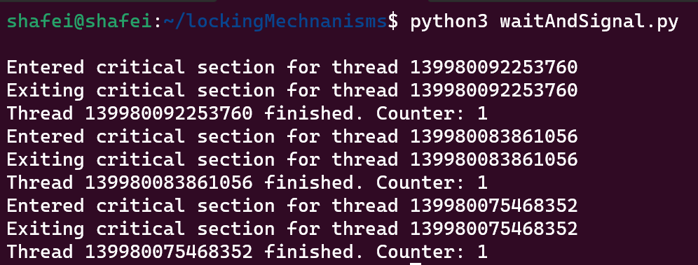
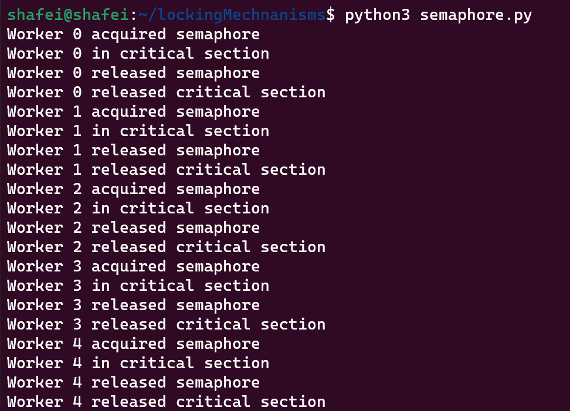

# **Locking Mechanisms**
<br>
<br>
<br>

## **1. TEST and SET**
**Test-and-set is a type of locking mechanism that uses a single atomic operation to test the value of a lock variable and set it to a new value. The lock variable can have only two possible values, either locked or unlocked. This mechanism ensures that only one process or thread can acquire the lock at a time, preventing race conditions and other synchronization issues.**
# Implementation
#### Code
```python
import threading

tas_lock = threading.Lock()
locked = False

counter = 0

def critical_section():
    global counter
    # Simulate some work
    for i in range(5):
        counter += 1

def tas_acquire(thread_id):
    global locked
    while True:
        with tas_lock:
            if not locked:
                locked = True
                print(f"Thread {thread_id} acquired the lock")
                return
            else:
                print(f"Thread {thread_id} is waiting for the lock")

def tas_release(thread_id):
    global locked
    with tas_lock:
        locked = False
        print(f"Thread {thread_id} released the lock")

def worker(thread_id):
    tas_acquire(thread_id)
    print(f"Thread {thread_id} entered the critical section")
    critical_section()
    print(f"Thread {thread_id} exited the critical section")
    tas_release(thread_id)

# Start multiple threads to execute the worker function
threads = []
for i in range(3):
    t = threading.Thread(target=worker, args=(i,))
    threads.append(t)

for t in threads:
    t.start()

for t in threads:
    t.join()

print("Counter value:", counter)
```
#### **Output**

<br>
<br>
<br>

## **2. WAIT and SIGNAL**
**WAIT and SIGNAL are two fundamental operations in process synchronization. The WAIT operation causes a process to block or wait until a certain condition is true. The SIGNAL operation is used to wake up a waiting process when the condition it is waiting for becomes true. This mechanism is often used in conjunction with a shared variable or semaphore to coordinate the activities of multiple processes or threads.**
# Implementation
#### **Code**
```python
import threading

lock = threading.Lock()
condition = threading.Condition(lock)

def critical_section():
    print(f"Entered critical section for thread {threading.get_ident()}")
    # do some critical work here
    print(f"Exiting critical section for thread {threading.get_ident()}")

def wait_and_signal(counter):
    with condition:
        condition.wait()
        critical_section()
        counter += 1
        print(f"Thread {threading.get_ident()} finished. Counter: {counter}")
        condition.notify()

# create three counters
counters = [0, 0, 0]

# create three threads
threads = []
for i in range(3):
    t = threading.Thread(target=wait_and_signal, args=(counters[i],))
    threads.append(t)

# start all threads
for t in threads:
    t.start()

# signal all threads to wake up
with condition:
    condition.notify_all()

```
#### **Output**

<br>
<br>
<br>

## **3. SEMAPHORES**
**A semaphore is a variable that is used to control access to a shared resource in a concurrent system. Semaphores can be used to enforce mutual exclusion, to control access to a shared resource, or to coordinate the activities of multiple processes or threads. Semaphores can be implemented using either binary or counting variables. A binary semaphore can only have two values, 0 and 1, while a counting semaphore can have a range of values.**

# Implementation
#### **Code**
```python
import threading

def Semaphore(value=1):
    mutex = threading.Lock()
    sem = threading.Condition(mutex)
    count = value

    def acquire():
        nonlocal count
        with sem:
            while count == 0:
                print(f"{threading.current_thread().name} is waiting for semaphore")
                sem.wait()
            count -= 1
            print(f"{threading.current_thread().name} acquired semaphore")

    def release():
        nonlocal count
        with sem:
            count += 1
            print(f"{threading.current_thread().name} released semaphore")
            sem.notify()

    return acquire, release

# Example usage
acquire, release = Semaphore()

def worker():
    acquire()
    print(f"{threading.current_thread().name} in critical section")
    # Do some work
    release()
    print(f"{threading.current_thread().name} released critical section")

threads = []
for i in range(5):
    thread = threading.Thread(target=worker, name=f"Worker {i}")
    threads.append(thread)
    thread.start()

for thread in threads:
    thread.join()
```
#### **Output**


# Readers And Writers Application
### **Readers-writers problem is a classical synchronization problem that involves concurrent access to shared resources by multiple readers and writers. The problem is to design a synchronization scheme that allows multiple readers to access the resource simultaneously, while ensuring that writers have exclusive access to the resource to avoid race conditions and data inconsistencies.**

<br>

# Implementation
#### **Code**
```python
import threading

NUM_SEATS = 10

def AirlineReservationSystem():
    # Semaphore to control seat access
    seat_sem = threading.Semaphore(value=NUM_SEATS)

    # Condition variable to wait for plane to take off
    plane_cond = threading.Condition()

    def reserve_seat():
        # Acquire a seat semaphore
        seat_sem.acquire()
        print(f"{threading.current_thread().name} reserved a seat")

        # Wait for the plane to take off
        with plane_cond:
            print(f"{threading.current_thread().name} is waiting for takeoff")
            plane_cond.wait()

        # Release the seat semaphore
        seat_sem.release()
        print(f"{threading.current_thread().name} released the seat")

    def takeoff():
        # Signal the condition variable to indicate the plane is taking off
        with plane_cond:
            print("Pilot signaled takeoff")
            plane_cond.notify_all()

    return reserve_seat, takeoff

# Example usage
reserve_seat, takeoff = AirlineReservationSystem()

passengers = []
for i in range(20):
    passenger = threading.Thread(target=reserve_seat, name=f"Passenger {i}")
    passengers.append(passenger)
    passenger.start()

# Wait for all passengers to reserve seats
for passenger in passengers:
    passenger.join()

# Take off
takeoff()
```
#### **Output**
